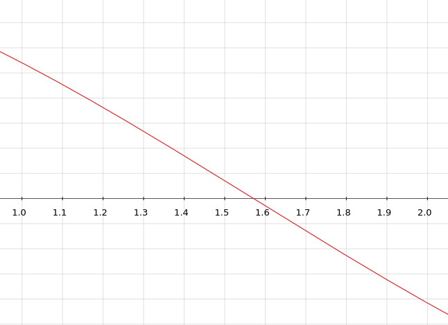
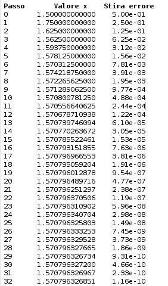

# Metodo delle successive bisezioni

Implementazione del metodo delle successive bisezioni per il calcolo degli zeri di una funzione $(f(\alpha) = 0)$

## Idea generale
L'algoritmo di basa sulla ripetuta divisione di un intervallo dato in input, inizialmente si verificano le ipotesi del [teorema di Bolzano](https://it.wikipedia.org/wiki/Teorema_di_Bolzano), se soddisfatte si procederà con la divisione dell'intervallo [a, b] in due semi-intervalli [a, m] e [m , b], si andranno nuovamente a valutare le ipotesi del teorema e nell'intervallo dove saranno soddisfatte si procederà nuovamente con la divisione e così via fino a che non si avrà una buona approssimazione del valore.

## Iterata generale

$$ x^k = \frac{a^k + b^k}{2}$$

----

## Esempio 

Sia $f: \mathbb{R} \longrightarrow [-1, 1]$ t.c. $f(x) = cos(x)$,
siano, inoltre 
* $a = 1$
* $b = 2$  
* $tolleranza = 10^{-10}$

Essendo la funzione continua, le ipotesi del teorema di Bolzano sono rispettate e deve esservi una radice compresa tra $[1, 2]$, quindi 
$$x^0 = \frac{1+2}{2} = 1.5 $$
La funzione, quindi, sarà valutata, $f(1.5) = cos(1.5) = 0.0707$, essendo un valore positivo si andrà a considerare l'intervallo $[1.5, 2]$ dato che $f(1.5)*f(2) < 0$, quindi la prissima iterata sarà
$$ x^1 = \frac{1.5 + 2}{2}$$
Di seguito riportata la tabella delle varie iterate generate con Matlab:

Oss. L'algoritmo si ferma quando trova un'approssimazione della radice al disotto di una tolleranza (input) oppure quando raggionge il masismo numero di passi stabilito (input).

